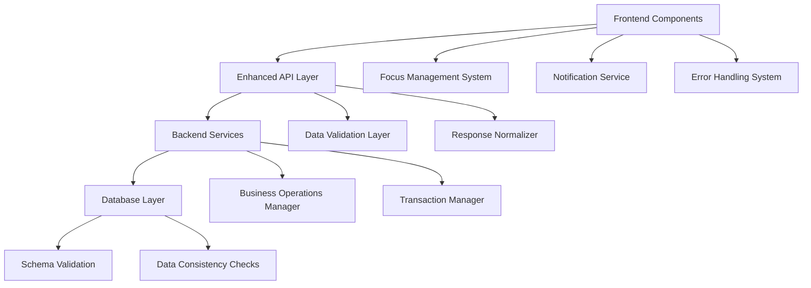
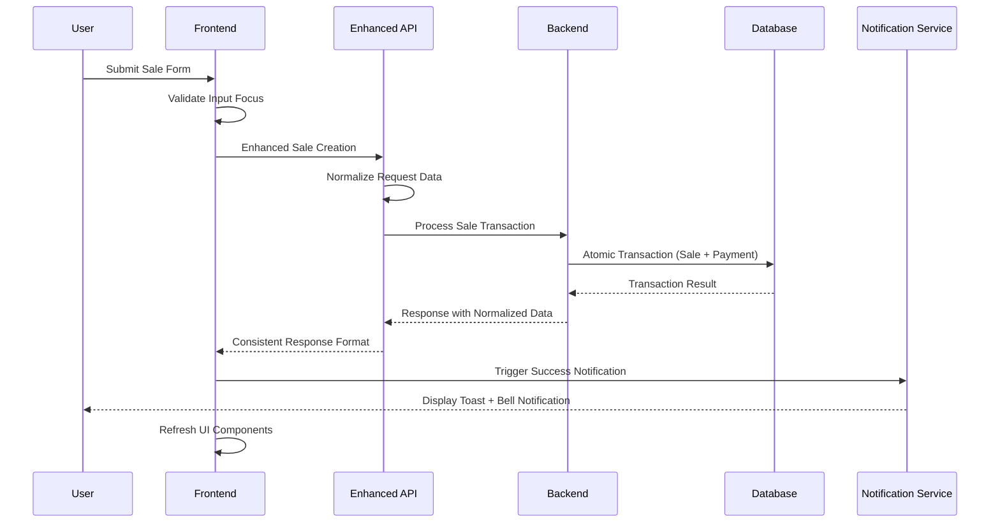

# Design Document

## Overview

This design addresses critical issues in the SabiOps application by implementing comprehensive fixes for sales creation, input focus stability, notification system, and error handling. The solution focuses on data consistency, proper error handling, and improved user experience across all platforms.

## Architecture

### System Components



### Data Flow Architecture



## Components and Interfaces

### 1. Enhanced Sales Creation System

#### Frontend Components
- **SalesForm Component**: Stable input handling with focus management
- **ProductSelector**: Enhanced dropdown with proper data loading
- **PaymentProcessor**: Integrated payment handling with error recovery

#### API Layer Enhancements
```javascript
// Enhanced Sales API with proper data transformation
export const enhancedCreateSale = async (saleData) => {
  // Transform frontend data to match backend expectations
  const transformedData = {
    product_id: saleData.product_id,
    customer_id: saleData.customer_id || null,
    customer_name: saleData.customer_name || 'Walk-in Customer',
    quantity: parseInt(saleData.quantity),
    unit_price: parseFloat(saleData.unit_price),
    total_amount: parseFloat(saleData.total_amount),
    payment_method: saleData.payment_method || 'cash',
    date: saleData.date || new Date().toISOString(),
    salesperson_id: saleData.salesperson_id || null
  };
  
  // Include payment data if provided
  if (saleData.payment_method && saleData.payment_method !== 'pending') {
    transformedData.payment_data = {
      amount: transformedData.total_amount,
      payment_method: transformedData.payment_method,
      customer_email: saleData.customer_email || null,
      currency: 'NGN'
    };
  }
  
  return await createSale(transformedData);
};
```

#### Backend Service Updates
```python
# Enhanced sale creation with atomic transactions
@sales_bp.route("/", methods=["POST"])
@jwt_required()
def create_sale():
    try:
        data = request.get_json()
        owner_id = get_jwt_identity()
        
        # Validate required fields with clear error messages
        validation_errors = validate_sale_data(data)
        if validation_errors:
            return error_response(validation_errors, "Validation failed", 400)
        
        # Use atomic transaction for sale and payment
        with supabase.transaction():
            # Create sale record
            sale_result = create_sale_record(data, owner_id)
            
            # Create payment record if payment data provided
            if data.get('payment_data'):
                payment_result = create_payment_record(
                    data['payment_data'], 
                    owner_id, 
                    sale_result['id']
                )
            
            # Update product inventory
            update_product_inventory(data['product_id'], data['quantity'])
            
        return success_response(sale_result, "Sale created successfully", 201)
        
    except Exception as e:
        return error_response(str(e), "Failed to create sale", 500)
```

### 2. Input Focus Management System

#### Focus Manager Component
```javascript
class FocusManager {
  static preserveFocus(element, callback) {
    const activeElement = document.activeElement;
    const selectionStart = activeElement.selectionStart;
    const selectionEnd = activeElement.selectionEnd;
    
    callback();
    
    // Restore focus and cursor position
    if (activeElement && activeElement.focus) {
      activeElement.focus();
      if (selectionStart !== undefined) {
        activeElement.setSelectionRange(selectionStart, selectionEnd);
      }
    }
  }
  
  static createStableInput(props) {
    return {
      ...props,
      onFocus: (e) => {
        e.target.dataset.focused = 'true';
        props.onFocus?.(e);
      },
      onBlur: (e) => {
        // Delay blur to prevent premature focus loss
        setTimeout(() => {
          e.target.dataset.focused = 'false';
          props.onBlur?.(e);
        }, 100);
      }
    };
  }
}
```

#### Stable Input Components
```jsx
// Enhanced StableInput with focus preservation
const StableInput = React.forwardRef(({ onChange, ...props }, ref) => {
  const handleChange = useCallback((e) => {
    FocusManager.preserveFocus(e.target, () => {
      onChange?.(e);
    });
  }, [onChange]);
  
  return (
    <Input
      ref={ref}
      {...props}
      onChange={handleChange}
      onFocus={(e) => e.target.dataset.focused = 'true'}
      onBlur={(e) => setTimeout(() => e.target.dataset.focused = 'false', 100)}
    />
  );
});
```

### 3. Enhanced Notification System

#### Notification Service Architecture
```javascript
class NotificationService {
  constructor() {
    this.notifications = [];
    this.unreadCount = 0;
    this.listeners = [];
    this.toastQueue = [];
  }
  
  // Business-specific notifications
  showSaleSuccess(saleData) {
    const message = `Sale of ₦${saleData.total_amount.toLocaleString()} recorded successfully!`;
    
    // Show toast notification
    this.showToast(message, 'success', {
      duration: 5000,
      icon: '💰'
    });
    
    // Add to notification bell
    this.addNotification({
      type: 'sale_success',
      title: 'Sale Recorded',
      message: `₦${saleData.total_amount.toLocaleString()} from ${saleData.customer_name || 'Walk-in Customer'}`,
      timestamp: new Date().toISOString(),
      action_url: '/sales'
    });
  }
  
  showLowStockAlert(product) {
    const message = `Low stock: ${product.name} (${product.quantity} left)`;
    
    this.showToast(message, 'warning', {
      duration: 8000,
      icon: '📦'
    });
    
    this.addNotification({
      type: 'low_stock',
      title: 'Low Stock Alert',
      message: `${product.name} - ${product.quantity} items remaining`,
      timestamp: new Date().toISOString(),
      action_url: '/products'
    });
  }
  
  addNotification(notification) {
    this.notifications.unshift({
      id: Date.now(),
      read: false,
      ...notification
    });
    
    this.unreadCount++;
    this.notifyListeners();
  }
}
```

#### Notification Bell Component
```jsx
const NotificationBell = () => {
  const [notifications, setNotifications] = useState([]);
  const [unreadCount, setUnreadCount] = useState(0);
  const [isOpen, setIsOpen] = useState(false);
  
  useEffect(() => {
    const unsubscribe = notificationService.addListener(({ notifications, unreadCount }) => {
      setNotifications(notifications);
      setUnreadCount(unreadCount);
    });
    
    return unsubscribe;
  }, []);
  
  return (
    <div className="relative">
      <Button
        variant="ghost"
        size="sm"
        onClick={() => setIsOpen(!isOpen)}
        className="relative"
      >
        <Bell className="h-5 w-5" />
        {unreadCount > 0 && (
          <Badge className="absolute -top-1 -right-1 h-5 w-5 rounded-full bg-red-500 text-white text-xs">
            {unreadCount > 99 ? '99+' : unreadCount}
          </Badge>
        )}
      </Button>
      
      {isOpen && (
        <NotificationDropdown
          notifications={notifications}
          onClose={() => setIsOpen(false)}
          onMarkAsRead={(id) => notificationService.markAsRead(id)}
        />
      )}
    </div>
  );
};
```

### 4. Comprehensive Error Handling System

#### Error Handler Component
```javascript
class ErrorHandler {
  static handleApiError(error, context = '') {
    const errorInfo = {
      message: 'An unexpected error occurred',
      details: error.message,
      context,
      timestamp: new Date().toISOString()
    };
    
    // Specific error handling
    if (error.response) {
      const { status, data } = error.response;
      
      switch (status) {
        case 400:
          errorInfo.message = data.error || 'Invalid request data';
          break;
        case 401:
          errorInfo.message = 'Authentication required';
          // Redirect to login
          window.location.href = '/login';
          break;
        case 403:
          errorInfo.message = 'Access denied';
          break;
        case 404:
          errorInfo.message = 'Resource not found';
          break;
        case 500:
          errorInfo.message = 'Server error - please try again';
          break;
        default:
          errorInfo.message = `Request failed (${status})`;
      }
      
      // Show specific field errors
      if (data.error && typeof data.error === 'object') {
        errorInfo.fieldErrors = data.error;
      }
    }
    
    // Log error for debugging
    console.error(`[${context}] API Error:`, errorInfo);
    
    // Show user-friendly notification
    notificationService.showToast(errorInfo.message, 'error');
    
    return errorInfo;
  }
  
  static handleFormValidation(errors) {
    const errorMessages = Object.entries(errors).map(([field, message]) => 
      `${field}: ${message}`
    ).join(', ');
    
    notificationService.showToast(`Please fix: ${errorMessages}`, 'warning');
    
    return errors;
  }
}
```

## Data Models

### Enhanced Sale Data Model
```typescript
interface SaleData {
  id?: string;
  owner_id: string;
  customer_id?: string;
  customer_name?: string;
  customer_email?: string;
  product_id: string;
  product_name: string;
  quantity: number;
  unit_price: number;
  total_amount: number;
  total_cogs?: number;
  gross_profit?: number;
  payment_method: 'cash' | 'card' | 'bank_transfer' | 'mobile_money' | 'pending';
  payment_data?: {
    amount: number;
    currency: string;
    customer_email?: string;
    reference?: string;
  };
  date: string;
  salesperson_id?: string;
  created_at?: string;
  updated_at?: string;
}
```

### Payment Data Model
```typescript
interface PaymentData {
  id?: string;
  owner_id: string;
  sale_id?: string;
  invoice_id?: string;
  amount: number;
  currency: string;
  customer_email?: string;
  payment_method: string;
  payment_reference?: string;
  status: 'pending' | 'completed' | 'failed' | 'cancelled';
  paid_at?: string;
  created_at?: string;
  updated_at?: string;
}
```

### Notification Data Model
```typescript
interface NotificationData {
  id: string;
  type: 'sale_success' | 'low_stock' | 'payment_received' | 'error' | 'info';
  title: string;
  message: string;
  read: boolean;
  timestamp: string;
  action_url?: string;
  metadata?: Record<string, any>;
}
```

## Error Handling

### Error Categories and Responses

1. **Validation Errors (400)**
   - Missing required fields
   - Invalid data formats
   - Business rule violations

2. **Authentication Errors (401/403)**
   - Invalid or expired tokens
   - Insufficient permissions

3. **Resource Errors (404)**
   - Product not found
   - Customer not found
   - Sale record not found

4. **Server Errors (500)**
   - Database connection issues
   - Unexpected server failures
   - Third-party service failures

### Error Recovery Strategies

```javascript
const ErrorRecovery = {
  async retryWithBackoff(operation, maxRetries = 3) {
    for (let i = 0; i < maxRetries; i++) {
      try {
        return await operation();
      } catch (error) {
        if (i === maxRetries - 1) throw error;
        await new Promise(resolve => setTimeout(resolve, Math.pow(2, i) * 1000));
      }
    }
  },
  
  async handleNetworkError(operation) {
    try {
      return await operation();
    } catch (error) {
      if (error.code === 'NETWORK_ERROR') {
        notificationService.showToast('Network error - please check your connection', 'error');
        return null;
      }
      throw error;
    }
  }
};
```

## Testing Strategy

### Unit Testing
- Component-level focus management tests
- API data transformation tests
- Notification service functionality tests
- Error handling scenario tests

### Integration Testing
- End-to-end sales creation flow
- Payment processing integration
- Real-time notification delivery
- Cross-component data synchronization

### User Acceptance Testing
- Mobile device focus behavior
- Toast notification visibility and timing
- Error message clarity and actionability
- Data consistency across page refreshes

## Performance Considerations

### Frontend Optimizations
- Debounced input validation
- Memoized component re-renders
- Lazy loading of notification history
- Efficient state management

### Backend Optimizations
- Database transaction optimization
- Connection pooling
- Response caching where appropriate
- Bulk operations for data consistency

### Mobile Optimizations
- Touch-friendly interface elements
- Reduced network requests
- Offline capability for critical operations
- Progressive loading strategies