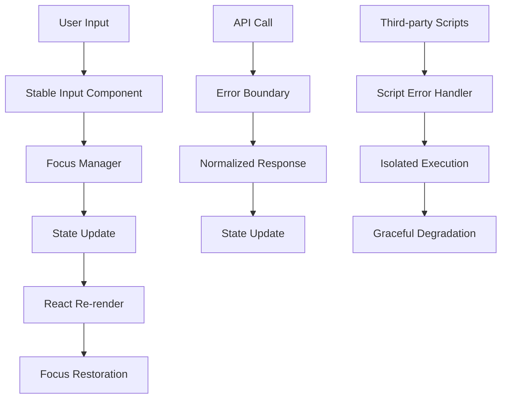

# Critical UI Stability Fix Design

## Overview

This design addresses critical stability issues in the Biz application that are causing page reloads, focus loss, and component rendering failures. The solution involves fixing missing imports, improving error handling, stabilizing focus management, and eliminating third-party script interference.

## Architecture

### Core Problem Analysis

Based on the error logs and code analysis, the main issues are:

1. **Missing Component Imports**: `StableInput` is not properly imported in Products.jsx
2. **Function Reference Errors**: `logDropdownEvent` function is not available where expected
3. **Ad Script Interference**: Third-party monetization scripts causing page instability
4. **Focus Management Failures**: DOM elements disappearing during re-renders
5. **API Error Cascading**: Unhandled API errors causing component crashes

### Solution Architecture



## Components and Interfaces

### 1. Enhanced StableInput Component

**Purpose**: Provide a robust input component that maintains focus during React re-renders

**Key Features**:
- Automatic focus preservation
- Cursor position restoration
- Error boundary protection
- Debounced state updates

**Interface**:
```typescript
interface StableInputProps {
  value: string;
  onChange: (e: ChangeEvent<HTMLInputElement>) => void;
  preserveFocus?: boolean;
  debounceMs?: number;
  errorBoundary?: boolean;
  fallbackValue?: string;
}
```

### 2. Improved Focus Manager

**Purpose**: Centralized focus management with enhanced error handling

**Key Features**:
- DOM element existence checking
- Fallback element detection
- Focus restoration queue
- Error recovery mechanisms

**Interface**:
```typescript
interface FocusManager {
  preserveFocus(callback: () => void): void;
  restoreFocus(element: HTMLElement): boolean;
  queueFocusRestore(selector: string): void;
  clearFocusQueue(): void;
}
```

### 3. Script Error Isolation

**Purpose**: Prevent third-party script errors from affecting core functionality

**Key Features**:
- Script error boundaries
- Isolated execution contexts
- Graceful degradation
- Core functionality protection

### 4. Enhanced Debug Logger

**Purpose**: Comprehensive logging with missing function protection

**Key Features**:
- Function existence checking
- Safe method calls
- Error context preservation
- Development/production modes

## Data Models

### Focus State Model
```typescript
interface FocusState {
  activeElement: HTMLElement | null;
  selectionStart: number;
  selectionEnd: number;
  elementId: string;
  elementName: string;
  timestamp: number;
}
```

### Error Context Model
```typescript
interface ErrorContext {
  component: string;
  action: string;
  error: Error;
  timestamp: number;
  userAgent: string;
  url: string;
}
```

### API Response Model
```typescript
interface NormalizedResponse<T> {
  data: T;
  success: boolean;
  error?: string;
  metadata?: Record<string, any>;
}
```

## Error Handling

### 1. Component-Level Error Boundaries

Each major component will be wrapped with error boundaries that:
- Catch rendering errors
- Provide fallback UI
- Log error details
- Allow graceful recovery

### 2. API Error Handling

Implement comprehensive API error handling:
- Network timeout handling
- Response validation
- Retry mechanisms
- Fallback data sources

### 3. Script Error Isolation

Isolate third-party scripts:
- Wrap in try-catch blocks
- Use separate execution contexts
- Implement circuit breakers
- Provide core functionality fallbacks

### 4. Focus Error Recovery

Handle focus management errors:
- Element existence validation
- Alternative focus targets
- Focus restoration queues
- User notification systems

## Testing Strategy

### 1. Unit Tests

**Focus Management Tests**:
- Focus preservation during state updates
- Cursor position restoration
- Element existence validation
- Error recovery mechanisms

**Component Import Tests**:
- Import resolution verification
- Component availability checks
- Dependency validation
- Build-time error detection

**API Error Handling Tests**:
- Network failure scenarios
- Malformed response handling
- Timeout behavior
- Retry logic validation

### 2. Integration Tests

**Form Stability Tests**:
- Multi-character input scenarios
- Rapid typing simulation
- State update during input
- Focus maintenance verification

**Sales Flow Tests**:
- Product dropdown functionality
- Sale recording process
- Data display verification
- Error recovery testing

### 3. End-to-End Tests

**User Journey Tests**:
- Complete invoice creation
- Product management workflow
- Sales recording and display
- Error scenario handling

**Performance Tests**:
- Input responsiveness
- Re-render optimization
- Memory leak detection
- Script loading impact

## Implementation Phases

### Phase 1: Critical Fixes (Immediate)
1. Fix missing StableInput imports
2. Resolve function reference errors
3. Add basic error boundaries
4. Implement script error isolation

### Phase 2: Enhanced Stability (Short-term)
1. Improve focus management
2. Enhance API error handling
3. Add comprehensive logging
4. Implement fallback mechanisms

### Phase 3: Optimization (Medium-term)
1. Performance optimizations
2. Advanced error recovery
3. User experience improvements
4. Monitoring and analytics

## Security Considerations

### Script Isolation
- Prevent script injection attacks
- Validate third-party script sources
- Implement content security policies
- Monitor script behavior

### Data Validation
- Sanitize user inputs
- Validate API responses
- Prevent XSS attacks
- Secure error logging

### Error Information Disclosure
- Limit error details in production
- Sanitize error messages
- Protect sensitive information
- Implement secure logging

## Performance Considerations

### Focus Management
- Minimize DOM queries
- Cache element references
- Debounce focus operations
- Optimize re-render cycles

### Error Handling
- Lightweight error boundaries
- Efficient error logging
- Minimal performance impact
- Graceful degradation

### Script Loading
- Asynchronous script loading
- Non-blocking execution
- Timeout mechanisms
- Resource optimization

## Monitoring and Observability

### Error Tracking
- Component error rates
- Focus management failures
- API error patterns
- Script loading issues

### Performance Metrics
- Input responsiveness
- Re-render frequency
- Focus restoration time
- Error recovery time

### User Experience Metrics
- Form completion rates
- Error encounter frequency
- User satisfaction scores
- Task completion times