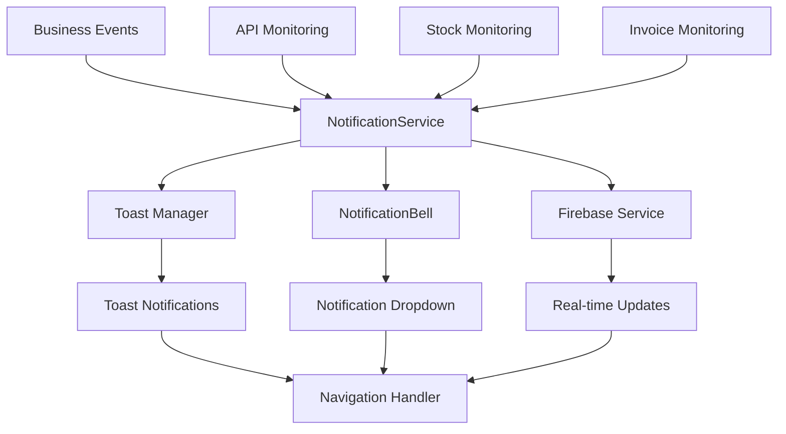

# Enhanced Notification System Design

## Overview

The enhanced notification system builds upon the existing NotificationBell component and notificationService to provide a comprehensive, YouTube-style notification experience with toast notifications for critical business events. The system will integrate seamlessly with the current Firebase infrastructure while preventing conflicts and infinite refresh loops.

## Architecture

### System Components



### Data Flow

1. **Event Detection**: Business events (low stock, overdue invoices) are detected through API monitoring
2. **Notification Creation**: Events trigger notification creation in the NotificationService
3. **Dual Display**: Notifications are simultaneously shown as toasts and added to the bell
4. **User Interaction**: Users can interact with either toast or bell notifications
5. **State Management**: Read/unread states are synchronized across all components
6. **Navigation**: Clicking notifications triggers navigation with visual feedback

## Components and Interfaces

### Enhanced NotificationService

```javascript
class NotificationService {
  // Existing methods enhanced
  showBusinessAlert(type, data) // New method for business-critical alerts
  addToastNotification(notification) // Enhanced toast handling
  preventFirebaseConflicts() // New conflict prevention
  
  // New notification types
  showLowStockAlert(productName, quantity, threshold)
  showOutOfStockAlert(productName)
  showNearingLimitAlert(limitType, current, max)
  showOverdueInvoiceAlert(invoiceNumber, amount, daysOverdue)
}
```

### Enhanced NotificationBell Component

```javascript
const NotificationBell = {
  // Enhanced features
  youtubeStyleDropdown: true,
  mobileResponsive: true,
  visualFeedback: true,
  
  // New methods
  handleCardClick(notification) // YouTube-style interaction
  markAsReadWithAnimation(id) // Visual feedback
  navigateWithEffect(url) // Smooth navigation
}
```

### New ToastManager Component

```javascript
const ToastManager = {
  // Core functionality
  stackToasts: true,
  autoDissmiss: true,
  clickToNavigate: true,
  
  // Configuration
  positions: ['top-right', 'top-center', 'bottom-right'],
  durations: {
    success: 4000,
    warning: 6000,
    error: 8000,
    info: 5000
  }
}
```

### Enhanced Firebase Integration

```javascript
const FirebaseService = {
  // Conflict prevention
  debounceNotifications: true,
  preventInfiniteRefresh: true,
  fallbackPolling: true,
  
  // Error handling
  gracefulDegradation: true,
  offlineSupport: true,
  retryMechanism: true
}
```

## Data Models

### Enhanced Notification Model

```typescript
interface Notification {
  id: string;
  type: 'low_stock' | 'out_of_stock' | 'nearing_limit' | 'overdue_invoice' | 'payment_received';
  title: string;
  message: string;
  timestamp: string;
  read: boolean;
  priority: 'low' | 'medium' | 'high' | 'urgent';
  
  // Navigation data
  action_url: string;
  action_params?: Record<string, any>;
  
  // Display data
  icon: string;
  color: string;
  category: string;
  
  // Business data
  data: {
    productId?: string;
    invoiceId?: string;
    customerId?: string;
    amount?: number;
    quantity?: number;
    threshold?: number;
    daysOverdue?: number;
  };
  
  // Toast configuration
  toast?: {
    duration: number;
    position: string;
    dismissible: boolean;
  };
}
```

### Toast Configuration Model

```typescript
interface ToastConfig {
  type: 'success' | 'warning' | 'error' | 'info';
  duration: number;
  position: 'top-right' | 'top-center' | 'bottom-right';
  dismissible: boolean;
  clickAction?: {
    url: string;
    params?: Record<string, any>;
  };
  animation: {
    enter: string;
    exit: string;
  };
}
```

## Error Handling

### Firebase Conflict Prevention

1. **Debouncing**: Implement 500ms debounce on Firebase message handling
2. **Duplicate Detection**: Check for duplicate notifications within 5-second window
3. **Polling Fallback**: If Firebase fails, fall back to 30-second polling
4. **Circuit Breaker**: Stop Firebase polling if consecutive errors exceed threshold

### Toast Error Handling

1. **Stack Overflow Protection**: Limit maximum concurrent toasts to 5
2. **Memory Management**: Auto-cleanup dismissed toasts after 30 seconds
3. **Render Error Recovery**: Graceful fallback if toast rendering fails
4. **Navigation Error Handling**: Show error toast if navigation fails

### Mobile Responsiveness Handling

1. **Viewport Detection**: Detect screen size and adjust notification positioning
2. **Touch Target Optimization**: Ensure minimum 44px touch targets on mobile
3. **Overflow Prevention**: Implement proper scrolling and content clipping
4. **Performance Optimization**: Lazy load notification content on mobile

## Testing Strategy

### Unit Tests

1. **NotificationService Tests**
   - Test each notification type creation
   - Test Firebase conflict prevention
   - Test toast stacking and dismissal
   - Test navigation handling

2. **NotificationBell Tests**
   - Test dropdown opening/closing
   - Test mark as read functionality
   - Test mobile responsiveness
   - Test keyboard navigation

3. **ToastManager Tests**
   - Test toast positioning and stacking
   - Test auto-dismissal timing
   - Test click-to-navigate functionality
   - Test animation performance

### Integration Tests

1. **End-to-End Notification Flow**
   - Create business event → Toast appears → Bell updates → User clicks → Navigation occurs
   - Test with multiple simultaneous notifications
   - Test Firebase and local notification synchronization

2. **Mobile Responsiveness Tests**
   - Test on various screen sizes (320px to 1920px)
   - Test touch interactions on mobile devices
   - Test notification dropdown on mobile

3. **Performance Tests**
   - Test with 100+ notifications in bell
   - Test rapid-fire toast notifications
   - Test memory usage over extended periods

### User Acceptance Tests

1. **Business Scenario Tests**
   - Low stock alert workflow
   - Overdue invoice alert workflow
   - Out of stock alert workflow
   - Multiple alert handling

2. **User Experience Tests**
   - YouTube-style interaction patterns
   - Visual feedback and animations
   - Mobile usability testing
   - Accessibility compliance testing

## Implementation Considerations

### Performance Optimizations

1. **Virtual Scrolling**: For notification lists with 50+ items
2. **Lazy Loading**: Load notification details on demand
3. **Memoization**: Cache notification components to prevent re-renders
4. **Debouncing**: Debounce rapid notification updates

### Accessibility Features

1. **Screen Reader Support**: Proper ARIA labels and announcements
2. **Keyboard Navigation**: Full keyboard accessibility for dropdown
3. **High Contrast**: Support for high contrast mode
4. **Focus Management**: Proper focus handling for modal interactions

### Security Considerations

1. **XSS Prevention**: Sanitize all notification content
2. **CSRF Protection**: Secure notification API endpoints
3. **Rate Limiting**: Prevent notification spam attacks
4. **Data Validation**: Validate all notification data before processing

### Monitoring and Analytics

1. **Notification Metrics**: Track notification open rates, click-through rates
2. **Performance Monitoring**: Monitor toast rendering performance
3. **Error Tracking**: Track and alert on notification system errors
4. **User Behavior**: Track which notifications drive the most engagement