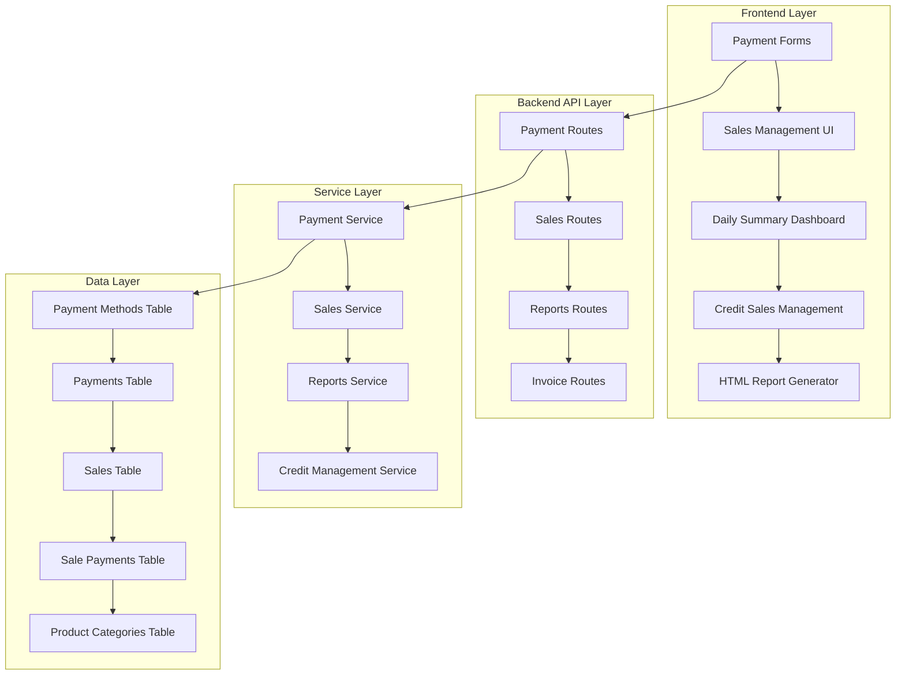

# Design Document

## Overview

This design document outlines the enhanced payment and sales management system for SabiOPS, addressing the critical needs of Nigerian SMEs for accurate payment tracking, POS integration, and credit sales management. The solution provides a comprehensive framework for handling various payment methods, generating daily financial summaries, and managing credit sales with partial payment capabilities.

The system is designed to work with manual input for POS transactions (since direct API integration with various Nigerian POS terminals is not feasible), while maintaining accuracy and providing detailed reconciliation capabilities.

## Architecture

### High-Level Architecture



### Database Schema Changes

The design introduces several new tables and modifies existing ones to support enhanced payment tracking and credit sales management.

#### New Tables

**1. payment_methods**
```sql
CREATE TABLE payment_methods (
    id UUID PRIMARY KEY DEFAULT uuid_generate_v4(),
    name VARCHAR(100) NOT NULL UNIQUE,
    type VARCHAR(50) NOT NULL, -- 'Cash', 'Digital', 'Credit'
    is_pos BOOLEAN DEFAULT FALSE,
    requires_reference BOOLEAN DEFAULT FALSE,
    created_at TIMESTAMP WITH TIME ZONE DEFAULT NOW(),
    updated_at TIMESTAMP WITH TIME ZONE DEFAULT NOW()
);
```

**2. sale_payments** (for partial payment tracking)
```sql
CREATE TABLE sale_payments (
    id UUID PRIMARY KEY DEFAULT uuid_generate_v4(),
    sale_id UUID NOT NULL REFERENCES sales(id) ON DELETE CASCADE,
    payment_id UUID REFERENCES payments(id) ON DELETE SET NULL,
    amount_paid NUMERIC(10,2) NOT NULL,
    payment_date TIMESTAMP WITH TIME ZONE DEFAULT NOW(),
    payment_method_id UUID NOT NULL REFERENCES payment_methods(id),
    notes TEXT,
    created_at TIMESTAMP WITH TIME ZONE DEFAULT NOW(),
    updated_at TIMESTAMP WITH TIME ZONE DEFAULT NOW()
);
```

**3. product_categories**
```sql
CREATE TABLE product_categories (
    id UUID PRIMARY KEY DEFAULT uuid_generate_v4(),
    name VARCHAR(100) NOT NULL UNIQUE,
    description TEXT,
    created_at TIMESTAMP WITH TIME ZONE DEFAULT NOW(),
    updated_at TIMESTAMP WITH TIME ZONE DEFAULT NOW()
);
```

#### Modified Tables

**1. payments table enhancements**
```sql
ALTER TABLE payments 
ADD COLUMN payment_method_id UUID REFERENCES payment_methods(id),
ADD COLUMN is_pos_transaction BOOLEAN DEFAULT FALSE,
ADD COLUMN pos_account_name VARCHAR(100),
ADD COLUMN transaction_type VARCHAR(20) DEFAULT 'Sale', -- 'Sale', 'Refund', 'Deposit', 'Withdrawal'
ADD COLUMN pos_reference_number VARCHAR(100);
```

**2. sales table enhancements**
```sql
ALTER TABLE sales 
ADD COLUMN payment_method_id UUID REFERENCES payment_methods(id),
ADD COLUMN amount_paid NUMERIC(10,2) DEFAULT 0,
ADD COLUMN amount_due NUMERIC(10,2) DEFAULT 0,
ADD COLUMN product_category_id UUID REFERENCES product_categories(id);
```

**3. products table enhancement**
```sql
ALTER TABLE products 
ADD COLUMN category_id UUID REFERENCES product_categories(id);
```

## Components and Interfaces

### Frontend Components

#### 1. Enhanced Payment Form Component
```javascript
// PaymentMethodSelector.jsx
const PaymentMethodSelector = ({
  value,
  onChange,
  showPOSFields = false,
  onPOSFieldsChange
}) => {
  // Renders standardized payment method dropdown
  // Shows additional POS fields when POS method selected
  // Handles POS account name, transaction type, reference number
}
```

#### 2. Credit Sales Management Component
```javascript
// CreditSalesManager.jsx
const CreditSalesManager = ({
  saleId,
  currentBalance,
  paymentHistory,
  onPartialPayment
}) => {
  // Displays outstanding balance
  // Shows payment history
  // Allows recording partial payments
  // Updates payment status automatically
}
```

#### 3. Daily Summary Dashboard Component
```javascript
// DailySummaryDashboard.jsx
const DailySummaryDashboard = ({
  date,
  onDateChange,
  onDownloadHTML
}) => {
  // Displays cash at hand
  // Shows POS deposits/withdrawals
  // Displays category-wise sales
  // Provides HTML download functionality
}
```

### Backend API Endpoints

#### 1. Payment Management Endpoints
```python
# /api/payments/methods - GET
# Returns standardized payment methods list

# /api/payments/record - POST
# Records payment with enhanced POS tracking
# Payload: {
#   amount, payment_method_id, is_pos_transaction,
#   pos_account_name, transaction_type, pos_reference_number
# }

# /api/payments/daily-summary - GET
# Returns daily payment summary by method
```

#### 2. Sales Management Endpoints
```python
# /api/sales/create - POST
# Creates sale with payment status tracking
# Initializes amount_paid and amount_due for credit sales

# /api/sales/{sale_id}/update-status - PUT
# Updates sale payment status
# Handles transitions from credit to paid

# /api/sales/{sale_id}/partial-payment - POST
# Records partial payment against credit sale
# Updates amount_paid and amount_due
```

#### 3. Reports Endpoints
```python
# /api/reports/daily-summary - GET
# Returns comprehensive daily financial summary
# Parameters: date (optional, defaults to today)

# /api/reports/daily-summary/download-html - GET
# Generates and returns HTML download of daily summary
```

### Service Layer Architecture

#### 1. Payment Service
```python
class PaymentService:
    def record_payment(self, payment_data):
        # Validates payment method
        # Records payment with POS details if applicable
        # Updates related sale/invoice status
        
    def get_daily_cash_summary(self, date):
        # Calculates cash at hand
        # Considers cash in and cash out
        
    def get_pos_summary(self, date):
        # Calculates POS deposits and withdrawals
        # Groups by POS account name
```

#### 2. Credit Sales Service
```python
class CreditSalesService:
    def record_partial_payment(self, sale_id, payment_data):
        # Records partial payment
        # Updates sale amounts
        # Changes status to 'Paid' when fully paid
        
    def get_outstanding_credit_sales(self, user_id):
        # Returns all unpaid credit sales
        # Calculates total outstanding amount
```

#### 3. Reports Service
```python
class ReportsService:
    def generate_daily_summary(self, date, user_id):
        # Aggregates all daily financial data
        # Returns structured summary object
        
    def generate_html_report(self, summary_data):
        # Uses template engine to generate HTML
        # Returns formatted HTML for download
```

## Data Models

### Payment Method Model
```python
class PaymentMethod:
    id: UUID
    name: str  # 'Cash', 'POS - Card', 'POS - Transfer', etc.
    type: str  # 'Cash', 'Digital', 'Credit'
    is_pos: bool
    requires_reference: bool
```

### Enhanced Payment Model
```python
class Payment:
    # Existing fields...
    payment_method_id: UUID
    is_pos_transaction: bool
    pos_account_name: str
    transaction_type: str  # 'Sale', 'Refund', 'Deposit', 'Withdrawal'
    pos_reference_number: str
```

### Enhanced Sales Model
```python
class Sale:
    # Existing fields...
    payment_method_id: UUID
    amount_paid: Decimal
    amount_due: Decimal
    product_category_id: UUID
```

### Sale Payment Model
```python
class SalePayment:
    id: UUID
    sale_id: UUID
    payment_id: UUID
    amount_paid: Decimal
    payment_date: datetime
    payment_method_id: UUID
    notes: str
```

## Error Handling

### Payment Processing Errors
- **Invalid Payment Method**: Return structured error with valid options
- **POS Field Validation**: Ensure required POS fields are provided when POS method selected
- **Amount Validation**: Prevent negative amounts and ensure proper decimal handling

### Credit Sales Errors
- **Overpayment Prevention**: Validate partial payments don't exceed outstanding balance
- **Status Conflicts**: Handle concurrent payment updates gracefully
- **Data Consistency**: Ensure amount_paid + amount_due = total_amount

### Report Generation Errors
- **Date Range Validation**: Handle invalid date inputs
- **Data Availability**: Gracefully handle empty result sets
- **Template Errors**: Provide fallback for HTML generation failures

## Testing Strategy

### Unit Tests
- **Payment Service Tests**: Test payment recording with various methods
- **Credit Sales Logic**: Test partial payment calculations and status updates
- **Report Generation**: Test daily summary calculations with edge cases

### Integration Tests
- **End-to-End Payment Flow**: Test complete payment recording and status updates
- **Credit Sales Workflow**: Test full credit sale lifecycle with partial payments
- **Report Download**: Test HTML report generation and download functionality

### Manual Testing Scenarios
- **POS Transaction Recording**: Test manual entry of POS transactions with various terminals
- **Mixed Payment Methods**: Test sales with multiple payment methods
- **Credit Sales Management**: Test partial payment scenarios and status transitions

### Performance Tests
- **Daily Summary Generation**: Test with large datasets (1000+ transactions per day)
- **Report Generation**: Test HTML generation with complex data sets
- **Database Query Optimization**: Ensure efficient queries for daily summaries

## Implementation Phases

### Phase 1: Database Schema and Core Services
1. Create new tables (payment_methods, sale_payments, product_categories)
2. Modify existing tables with new columns
3. Implement core payment and sales services
4. Create data migration scripts for existing data

### Phase 2: Enhanced Payment Recording
1. Update payment recording endpoints
2. Implement POS transaction handling
3. Create payment method management
4. Update frontend payment forms

### Phase 3: Credit Sales Management
1. Implement partial payment functionality
2. Create credit sales management UI
3. Update sales status management
4. Implement revenue recognition logic

### Phase 4: Reporting and Analytics
1. Implement daily summary calculations
2. Create HTML report generation
3. Build daily summary dashboard
4. Implement download functionality

### Phase 5: Testing and Optimization
1. Comprehensive testing of all features
2. Performance optimization
3. User acceptance testing
4. Documentation and training materials