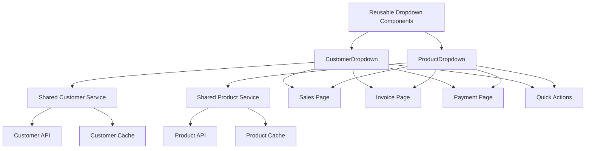

# Reusable Dropdown Components Design

## Overview

This design creates centralized, reusable Customer and Product dropdown components that can be shared across multiple pages (Sales, Invoice, Payment, Quick Actions) with a single source of truth. The solution addresses code duplication, inconsistent behavior, and maintenance challenges by providing standardized dropdown components with unified data services.

## Architecture

### Current Problem Analysis

Based on the existing codebase analysis, the current dropdown implementations have several issues:

1. **Code Duplication**: Each form (SalesForm, CustomInvoiceForm, ModernQuickActions) implements its own dropdown logic
2. **Inconsistent Data Handling**: Different forms handle customer/product data differently
3. **Scattered Data Fetching**: Each component fetches its own data independently
4. **Display Inconsistencies**: Product dropdowns show different information formats
5. **Maintenance Overhead**: Bug fixes and improvements need to be applied in multiple places

### Solution Architecture



## Components and Interfaces

### 1. CustomerDropdown Component

```typescript
interface CustomerDropdownProps {
  value?: string | null;                    // Customer ID or name
  onChange: (customer: CustomerSelection) => void;
  placeholder?: string;
  disabled?: boolean;
  required?: boolean;
  className?: string;
  style?: React.CSSProperties;
  allowWalkIn?: boolean;                    // Allow "Walk-in Customer" option
  debugLabel?: string;                      // For debugging purposes
  onError?: (error: Error) => void;
}

interface CustomerSelection {
  id: string | null;
  name: string;
  email?: string;
  phone?: string;
  isWalkIn: boolean;
}
```

### 2. ProductDropdown Component

```typescript
interface ProductDropdownProps {
  value?: string | null;                    // Product ID or name
  onChange: (product: ProductSelection) => void;
  placeholder?: string;
  disabled?: boolean;
  required?: boolean;
  className?: string;
  style?: React.CSSProperties;
  showStock?: boolean;                      // Show stock information
  showPrice?: boolean;                      // Show price information
  showQuantityInInput?: boolean;            // Show quantity in selected input
  showSearch?: boolean;                     // Show mini search input
  searchPlaceholder?: string;               // Placeholder for search input
  onSearchChange?: (searchTerm: string) => void; // Search change callback
  debugLabel?: string;                      // For debugging purposes
  onError?: (error: Error) => void;
}

interface ProductSelection {
  id: string;
  name: string;
  price: number;
  quantity: number;
  lowStockThreshold: number;
  isLowStock: boolean;
  isOutOfStock: boolean;
  displayText: string;                      // Formatted display text with quantity
}
```

### 3. DatePicker Component

```typescript
interface DatePickerProps {
  value?: string | Date | null;              // Date value in YYYY-MM-DD format or Date object
  onChange: (date: string) => void;          // Callback with YYYY-MM-DD format
  placeholder?: string;
  disabled?: boolean;
  required?: boolean;
  className?: string;
  style?: React.CSSProperties;
  min?: string;                              // Minimum date in YYYY-MM-DD format
  max?: string;                              // Maximum date in YYYY-MM-DD format
  format?: 'YYYY-MM-DD' | 'DD/MM/YYYY' | 'MM/DD/YYYY'; // Display format
  label?: string;                            // Optional label for the picker
  error?: string;                            // Error message to display
  debugLabel?: string;                       // For debugging purposes
}
```

### 4. Shared Data Services

```typescript
interface CustomerService {
  getCustomers(): Promise<Customer[]>;
  getCustomerById(id: string): Promise<Customer | null>;
  refreshCache(): Promise<void>;
  subscribe(callback: (customers: Customer[]) => void): () => void;
}

interface ProductService {
  getProducts(): Promise<Product[]>;
  getProductsWithStock(): Promise<Product[]>;
  getProductById(id: string): Promise<Product | null>;
  refreshCache(): Promise<void>;
  subscribe(callback: (products: Product[]) => void): () => void;
}
```

## Data Models

### 1. Customer Data Model

```typescript
interface Customer {
  id: string;
  name: string;
  email?: string;
  phone?: string;
  address?: string;
  created_at: string;
  updated_at: string;
}
```

### 2. Product Data Model

```typescript
interface Product {
  id: string;
  name: string;
  price: number;
  unit_price?: number;                      // Alternative price field
  quantity: number;
  low_stock_threshold: number;
  description?: string;
  category?: string;
  created_at: string;
  updated_at: string;
}
```

### 3. Cache Data Model

```typescript
interface CacheEntry<T> {
  data: T[];
  timestamp: number;
  expiresAt: number;
  isLoading: boolean;
  error: Error | null;
}
```

## Error Handling

### 1. Error Types

```typescript
enum DropdownErrorType {
  DATA_FETCH_FAILED = 'data_fetch_failed',
  NETWORK_ERROR = 'network_error',
  INVALID_SELECTION = 'invalid_selection',
  CACHE_ERROR = 'cache_error',
  VALIDATION_ERROR = 'validation_error'
}

interface DropdownError {
  type: DropdownErrorType;
  message: string;
  details?: any;
  timestamp: Date;
  component: string;
}
```

### 2. Error Recovery Strategies

1. **Data Fetch Failure**: Show cached data with retry option
2. **Network Error**: Display offline indicator and cached data
3. **Invalid Selection**: Clear selection and show warning
4. **Cache Error**: Fallback to direct API calls
5. **Validation Error**: Show user-friendly error message

### 3. Fallback Display Logic

```typescript
function getDisplayValue(
  selectedId: string | null, 
  options: DropdownOption[], 
  type: 'customer' | 'product'
): string {
  if (!selectedId) return '';
  
  // 1. Try exact match
  const option = options.find(opt => opt.id === selectedId);
  if (option) {
    return type === 'product' && option.quantity !== undefined
      ? `${option.name} - Qty: ${option.quantity}`
      : option.name;
  }
  
  // 2. Try partial match for legacy data
  const partialMatch = options.find(opt => 
    opt.id.toString().includes(selectedId.toString())
  );
  if (partialMatch) {
    console.warn(`Partial match found for ${selectedId}: ${partialMatch.name}`);
    return partialMatch.name;
  }
  
  // 3. Show ID with warning
  console.error(`No display name found for ID: ${selectedId}`);
  return `Unknown ${type} (${selectedId})`;
}
```

## Testing Strategy

### 1. Unit Tests

```typescript
describe('CustomerDropdown', () => {
  test('displays customer names correctly', () => {
    // Test that customer names are shown, not IDs
  });
  
  test('handles walk-in customer option', () => {
    // Test walk-in customer functionality
  });
  
  test('calls onChange with correct customer data', () => {
    // Test that onChange receives full customer object
  });
  
  test('handles loading and error states', () => {
    // Test loading indicators and error messages
  });
});

describe('ProductDropdown', () => {
  test('displays product name and quantity in input', () => {
    // Test that selected input shows "Product Name - Qty: 10"
  });
  
  test('shows stock information in options', () => {
    // Test stock indicators in dropdown options
  });
  
  test('disables out-of-stock products', () => {
    // Test that out-of-stock products are disabled
  });
  
  test('calls onChange with complete product data', () => {
    // Test that onChange receives full product object
  });
});
```

### 2. Integration Tests

```typescript
describe('Form Integration', () => {
  test('SalesForm uses reusable dropdowns', () => {
    // Test SalesForm integration
  });
  
  test('CustomInvoiceForm uses reusable dropdowns', () => {
    // Test CustomInvoiceForm integration
  });
  
  test('ModernQuickActions uses reusable dropdowns', () => {
    // Test QuickActions integration
  });
});
```

## Implementation Plan

### Phase 1: Core Components and Services

1. **Create Shared Data Services**
   - Implement CustomerService with caching
   - Implement ProductService with caching
   - Add subscription mechanism for real-time updates

2. **Create CustomerDropdown Component**
   - Implement reusable customer dropdown
   - Add walk-in customer support
   - Include loading and error states

3. **Create ProductDropdown Component**
   - Implement reusable product dropdown
   - Add stock information display
   - Include quantity in selected input display

### Phase 2: Form Integration

1. **Update SalesForm**
   - Replace existing dropdowns with reusable components
   - Test functionality and data flow

2. **Update CustomInvoiceForm**
   - Replace existing dropdowns with reusable components
   - Handle multiple product selections

3. **Update ModernQuickActions**
   - Replace existing dropdowns with reusable components
   - Test modal integration

### Phase 3: Testing and Optimization

1. **Comprehensive Testing**
   - Unit tests for all components
   - Integration tests for form usage
   - Manual testing across all pages

2. **Performance Optimization**
   - Implement efficient caching
   - Add virtual scrolling for large datasets
   - Optimize re-rendering

## Technical Specifications

### 1. File Structure

```
src/
├── components/
│   └── dropdowns/
│       ├── CustomerDropdown.jsx
│       ├── ProductDropdown.jsx
│       └── index.js
├── services/
│   ├── customerService.js
│   ├── productService.js
│   └── dropdownCache.js
└── hooks/
    ├── useCustomers.js
    └── useProducts.js
```

### 2. CustomerDropdown Implementation

```jsx
import React, { useState, useEffect } from 'react';
import { Select, SelectContent, SelectItem, SelectTrigger, SelectValue } from '../ui/select';
import { useCustomers } from '../../hooks/useCustomers';

const CustomerDropdown = ({
  value,
  onChange,
  placeholder = "Select customer",
  disabled = false,
  required = false,
  allowWalkIn = true,
  debugLabel,
  onError,
  ...props
}) => {
  const { customers, loading, error, refresh } = useCustomers();
  const [displayValue, setDisplayValue] = useState('');

  // Update display value when value or customers change
  useEffect(() => {
    if (!value) {
      setDisplayValue('');
      return;
    }

    if (value === 'walk-in' || value === 'Walk-in Customer') {
      setDisplayValue('Walk-in Customer');
      return;
    }

    // Find customer by ID or name
    const customer = customers.find(c => 
      c.id === value || c.name === value
    );

    if (customer) {
      setDisplayValue(customer.name);
    } else {
      setDisplayValue(`Unknown Customer (${value})`);
      console.warn(`Customer not found: ${value}`);
    }

    // Debug logging
    if (debugLabel) {
      console.log(`[${debugLabel}] Customer display value updated:`, {
        selectedValue: value,
        displayValue: customer?.name || `Unknown (${value})`,
        customersCount: customers.length
      });
    }
  }, [value, customers, debugLabel]);

  const handleSelect = (selectedValue) => {
    let customerSelection;

    if (selectedValue === 'walk-in') {
      customerSelection = {
        id: null,
        name: 'Walk-in Customer',
        isWalkIn: true
      };
    } else {
      const customer = customers.find(c => c.name === selectedValue);
      if (customer) {
        customerSelection = {
          id: customer.id,
          name: customer.name,
          email: customer.email,
          phone: customer.phone,
          isWalkIn: false
        };
      }
    }

    // Debug logging
    if (debugLabel) {
      console.log(`[${debugLabel}] Customer selection made:`, {
        selectedValue,
        customerSelection,
        timestamp: new Date().toISOString()
      });
    }

    if (customerSelection) {
      onChange(customerSelection);
    }
  };

  // Handle errors
  useEffect(() => {
    if (error && onError) {
      onError(error);
    }
  }, [error, onError]);

  return (
    <Select
      value={displayValue}
      onValueChange={handleSelect}
      disabled={disabled || loading}
      {...props}
    >
      <SelectTrigger className="h-12 text-base border-2 border-dashed border-blue-300" 
                     style={{ backgroundColor: '#f0f8ff' }}>
        <SelectValue>
          {loading ? 'Loading customers...' : 
           error ? 'Failed to load customers' :
           displayValue || placeholder}
        </SelectValue>
      </SelectTrigger>
      <SelectContent>
        {loading ? (
          <SelectItem value="loading" disabled>
            Loading customers...
          </SelectItem>
        ) : error ? (
          <SelectItem value="error" disabled>
            Failed to load customers
            <button onClick={refresh} className="ml-2 text-blue-600">
              Retry
            </button>
          </SelectItem>
        ) : (
          <>
            {allowWalkIn && (
              <SelectItem value="walk-in">
                Walk-in Customer
              </SelectItem>
            )}
            {customers.map((customer) => (
              <SelectItem key={customer.id} value={customer.name}>
                <div className="flex justify-between items-center w-full">
                  <span>{customer.name}</span>
                  {customer.email && (
                    <span className="text-xs text-gray-500 ml-2">
                      {customer.email}
                    </span>
                  )}
                </div>
              </SelectItem>
            ))}
          </>
        )}
      </SelectContent>
    </Select>
  );
};

export default CustomerDropdown;
```

### 3. ProductDropdown Implementation with Search

```jsx
import React, { useState, useEffect, useMemo } from 'react';
import { Select, SelectContent, SelectItem, SelectTrigger, SelectValue } from '../ui/select';
import { Input } from '../ui/input';
import { Search, RefreshCw } from 'lucide-react';
import { useProducts } from '../../hooks/useProducts';
import { formatNaira } from '../../utils/formatting';

const ProductDropdown = ({
  value,
  onChange,
  placeholder = "Select product",
  disabled = false,
  required = false,
  showStock = true,
  showPrice = true,
  showQuantityInInput = true,
  showSearch = true,
  searchPlaceholder = "Search products...",
  onSearchChange,
  debugLabel,
  onError,
  ...props
}) => {
  const { products, loading, error, refresh } = useProducts();
  const [displayValue, setDisplayValue] = useState('');
  const [searchTerm, setSearchTerm] = useState('');
  const [isOpen, setIsOpen] = useState(false);

  // Filter products based on search term
  const filteredProducts = useMemo(() => {
    if (!searchTerm.trim()) return products;
    
    return products.filter(product =>
      product.name.toLowerCase().includes(searchTerm.toLowerCase())
    );
  }, [products, searchTerm]);

  // Update display value when value or products change
  useEffect(() => {
    if (!value) {
      setDisplayValue('');
      return;
    }

    // Find product by ID or name
    const product = products.find(p => 
      p.id === value || p.name === value
    );

    if (product) {
      // Format display text with quantity if enabled
      const baseText = product.name;
      const quantityText = showQuantityInInput ? ` - Qty: ${product.quantity}` : '';
      setDisplayValue(baseText + quantityText);
    } else {
      setDisplayValue(`Unknown Product (${value})`);
      console.warn(`Product not found: ${value}`);
    }

    // Debug logging
    if (debugLabel) {
      console.log(`[${debugLabel}] Product display value updated:`, {
        selectedValue: value,
        displayValue: product ? product.name : `Unknown (${value})`,
        productsCount: products.length
      });
    }
  }, [value, products, showQuantityInInput, debugLabel]);

  const handleSelect = (selectedValue) => {
    const product = products.find(p => p.name === selectedValue);
    
    if (product) {
      const productSelection = {
        id: product.id,
        name: product.name,
        price: product.price || product.unit_price || 0,
        quantity: product.quantity || 0,
        lowStockThreshold: product.low_stock_threshold || 5,
        isLowStock: product.quantity <= (product.low_stock_threshold || 5) && product.quantity > 0,
        isOutOfStock: product.quantity === 0,
        displayText: showQuantityInInput ? 
          `${product.name} - Qty: ${product.quantity}` : 
          product.name
      };

      // Clear search when product is selected
      setSearchTerm('');
      setIsOpen(false);

      // Debug logging
      if (debugLabel) {
        console.log(`[${debugLabel}] Product selection made:`, {
          selectedValue,
          productSelection,
          timestamp: new Date().toISOString()
        });
      }

      onChange(productSelection);
    }
  };

  const handleSearchChange = (e) => {
    const newSearchTerm = e.target.value;
    setSearchTerm(newSearchTerm);
    
    // Open dropdown when user starts typing
    if (newSearchTerm.trim() && !isOpen) {
      setIsOpen(true);
    }

    // Call external search change handler if provided
    if (onSearchChange) {
      onSearchChange(newSearchTerm);
    }

    // Debug logging
    if (debugLabel) {
      console.log(`[${debugLabel}] Product search changed:`, {
        searchTerm: newSearchTerm,
        filteredCount: filteredProducts.length,
        timestamp: new Date().toISOString()
      });
    }
  };

  const handleSearchFocus = () => {
    setIsOpen(true);
  };

  const handleSearchKeyDown = (e) => {
    // Handle keyboard navigation
    if (e.key === 'ArrowDown' || e.key === 'ArrowUp') {
      e.preventDefault();
      // Focus will be handled by the Select component
    } else if (e.key === 'Escape') {
      setSearchTerm('');
      setIsOpen(false);
    }
  };

  // Handle errors
  useEffect(() => {
    if (error && onError) {
      onError(error);
    }
  }, [error, onError]);

  return (
    <div className="space-y-2">
      {/* Product Label and Controls Row */}
      <div className="flex items-center justify-between">
        <label className="text-base font-medium flex items-center gap-1">
          Product
          {required && <span className="text-red-500">*</span>}
        </label>
        <div className="flex items-center gap-2">
          {/* Mini Search Input */}
          {showSearch && (
            <div className="relative">
              <Search className="absolute left-2 top-1/2 transform -translate-y-1/2 h-3 w-3 text-gray-400" />
              <Input
                type="text"
                placeholder={searchPlaceholder}
                value={searchTerm}
                onChange={handleSearchChange}
                onFocus={handleSearchFocus}
                onKeyDown={handleSearchKeyDown}
                className="pl-7 pr-2 py-1 text-xs h-7 w-32 border border-gray-300 rounded"
                disabled={disabled || loading}
              />
            </div>
          )}
          
          {/* Refresh Button */}
          <button
            type="button"
            onClick={refresh}
            disabled={loading}
            className="p-1 text-gray-500 hover:text-gray-700 disabled:opacity-50"
            title="Refresh products"
          >
            <RefreshCw className={`h-3 w-3 ${loading ? 'animate-spin' : ''}`} />
          </button>
        </div>
      </div>

      {/* Product Dropdown */}
      <Select
        value={displayValue}
        onValueChange={handleSelect}
        disabled={disabled || loading}
        open={isOpen}
        onOpenChange={setIsOpen}
        {...props}
      >
        <SelectTrigger className="h-12 text-base border-2 border-dashed border-purple-300" 
                       style={{ backgroundColor: '#faf5ff' }}>
          <SelectValue>
            {loading ? 'Loading products...' : 
             error ? 'Failed to load products' :
             displayValue || placeholder}
          </SelectValue>
        </SelectTrigger>
        <SelectContent>
          {loading ? (
            <SelectItem value="loading" disabled>
              Loading products...
            </SelectItem>
          ) : error ? (
            <SelectItem value="error" disabled>
              Failed to load products
              <button onClick={refresh} className="ml-2 text-blue-600">
                Retry
              </button>
            </SelectItem>
          ) : filteredProducts.length === 0 ? (
            <SelectItem value="empty" disabled>
              {searchTerm.trim() 
                ? `No products found matching "${searchTerm}"`
                : "No products available"
              }
            </SelectItem>
          ) : (
            filteredProducts.map((product) => {
              const quantity = parseInt(product.quantity) || 0;
              const lowStockThreshold = parseInt(product.low_stock_threshold) || 5;
              const isOutOfStock = quantity === 0;
              const isLowStock = quantity <= lowStockThreshold && quantity > 0;
              
              return (
                <SelectItem 
                  key={product.id} 
                  value={product.name}
                  disabled={isOutOfStock}
                  className={isOutOfStock ? 'opacity-50' : ''}
                >
                  <div className="flex justify-between items-center w-full">
                    <span className={isOutOfStock ? 'line-through' : ''}>
                      {product.name}
                    </span>
                    <div className="flex items-center gap-2 ml-2">
                      {showPrice && (
                        <span className="text-xs text-green-600 font-medium">
                          {formatNaira(product.price || product.unit_price || 0)}
                        </span>
                      )}
                      {showStock && (
                        <span className={`text-xs px-2 py-1 rounded ${
                          isOutOfStock 
                            ? 'bg-red-100 text-red-700' 
                            : isLowStock 
                            ? 'bg-yellow-100 text-yellow-700' 
                            : 'bg-green-100 text-green-700'
                        }`}>
                          {isOutOfStock ? 'Out of Stock' : 
                           isLowStock ? `Low: ${quantity}` : 
                           `Qty: ${quantity}`}
                        </span>
                      )}
                    </div>
                  </div>
                </SelectItem>
              );
            })
          )}
        </SelectContent>
      </Select>
    </div>
  );
};

export default ProductDropdown;
```

### 4. DatePicker Implementation

```jsx
import React, { useState, useEffect } from 'react';
import { Calendar } from 'lucide-react';

const DatePicker = ({
  value,
  onChange,
  placeholder = "Select date",
  disabled = false,
  required = false,
  className = "",
  style,
  min,
  max,
  format = 'YYYY-MM-DD',
  label,
  error,
  debugLabel,
  ...props
}) => {
  const [displayValue, setDisplayValue] = useState('');
  const [internalValue, setInternalValue] = useState('');

  // Convert various input formats to YYYY-MM-DD
  const normalizeDate = (dateInput) => {
    if (!dateInput) return '';
    
    if (typeof dateInput === 'string') {
      // If already in YYYY-MM-DD format
      if (/^\d{4}-\d{2}-\d{2}$/.test(dateInput)) {
        return dateInput;
      }
      // Handle other string formats
      const date = new Date(dateInput);
      if (!isNaN(date.getTime())) {
        return date.toISOString().split('T')[0];
      }
    }
    
    if (dateInput instanceof Date && !isNaN(dateInput.getTime())) {
      return dateInput.toISOString().split('T')[0];
    }
    
    return '';
  };

  // Format date for display based on format prop
  const formatDateForDisplay = (dateString) => {
    if (!dateString) return '';
    
    const [year, month, day] = dateString.split('-');
    
    switch (format) {
      case 'DD/MM/YYYY':
        return `${day}/${month}/${year}`;
      case 'MM/DD/YYYY':
        return `${month}/${day}/${year}`;
      case 'YYYY-MM-DD':
      default:
        return dateString;
    }
  };

  // Update internal value when prop value changes
  useEffect(() => {
    const normalized = normalizeDate(value);
    setInternalValue(normalized);
    setDisplayValue(formatDateForDisplay(normalized));

    // Debug logging
    if (debugLabel) {
      console.log(`[${debugLabel}] DatePicker value updated:`, {
        originalValue: value,
        normalizedValue: normalized,
        displayValue: formatDateForDisplay(normalized),
        format: format
      });
    }
  }, [value, format, debugLabel]);

  const handleDateChange = (e) => {
    const newValue = e.target.value; // This will be in YYYY-MM-DD format from HTML input
    setInternalValue(newValue);
    setDisplayValue(formatDateForDisplay(newValue));

    // Debug logging
    if (debugLabel) {
      console.log(`[${debugLabel}] DatePicker change:`, {
        newValue,
        displayValue: formatDateForDisplay(newValue),
        timestamp: new Date().toISOString()
      });
    }

    // Always call onChange with YYYY-MM-DD format
    onChange(newValue);
  };

  // Get today's date in YYYY-MM-DD format for max constraint
  const today = new Date().toISOString().split('T')[0];

  return (
    <div className="space-y-1">
      {label && (
        <label className="text-base font-medium flex items-center gap-1">
          {label}
          {required && <span className="text-red-500">*</span>}
        </label>
      )}
      
      <div className="relative">
        <Calendar className="absolute left-3 top-1/2 transform -translate-y-1/2 h-4 w-4 text-gray-400 pointer-events-none" />
        <input
          type="date"
          value={internalValue}
          onChange={handleDateChange}
          disabled={disabled}
          required={required}
          min={min}
          max={max || today} // Default to today if no max is specified
          placeholder={placeholder}
          className={`
            w-full h-12 pl-10 pr-4 text-base
            border border-gray-300 rounded-md
            bg-white
            focus:outline-none focus:ring-2 focus:ring-blue-500 focus:border-blue-500
            disabled:bg-gray-100 disabled:cursor-not-allowed
            ${error ? 'border-red-500 focus:ring-red-500 focus:border-red-500' : ''}
            ${className}
          `}
          style={{
            // Mobile-friendly styles to prevent zoom and ensure proper display
            fontSize: '16px', // Prevents zoom on iOS
            ...style
          }}
          {...props}
        />
      </div>

      {error && (
        <div className="text-red-500 text-sm mt-1">
          {error}
        </div>
      )}

      {/* Mobile-specific styles */}
      <style jsx>{`
        @media (max-width: 768px) {
          input[type="date"] {
            /* Ensure date picker doesn't fall out of screen on mobile */
            position: relative;
            z-index: 1000;
          }
          
          /* Style the date picker popup on mobile */
          input[type="date"]::-webkit-calendar-picker-indicator {
            background: transparent;
            bottom: 0;
            color: transparent;
            cursor: pointer;
            height: auto;
            left: 0;
            position: absolute;
            right: 0;
            top: 0;
            width: auto;
          }
          
          /* Ensure proper mobile display */
          input[type="date"] {
            -webkit-appearance: none;
            -moz-appearance: none;
            appearance: none;
            background-color: white;
            border: 1px solid #d1d5db;
            border-radius: 0.375rem;
            padding: 0.75rem 1rem 0.75rem 2.5rem;
            font-size: 16px; /* Prevents zoom on iOS */
            line-height: 1.5;
            color: #374151;
          }
          
          input[type="date"]:focus {
            outline: none;
            border-color: #3b82f6;
            box-shadow: 0 0 0 3px rgba(59, 130, 246, 0.1);
          }
        }
      `}</style>
    </div>
  );
};

export default DatePicker;
```

This design provides a comprehensive solution for creating reusable dropdown and date picker components that address all the requirements while maintaining consistency and reducing code duplication across the application.